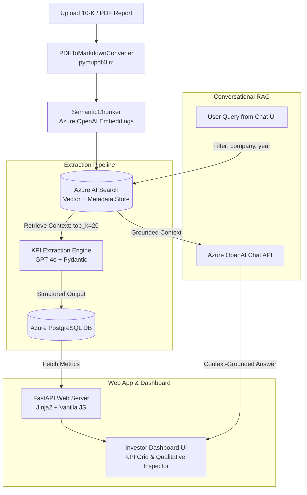

# AI-Powered Investor Intelligence Platform

<div align="center">


<br/>


<p align="center">
  <b>An enterprise-grade financial analytics and document intelligence platform built with Retrieval-Augmented Generation (RAG), Semantic Chunking, Azure AI Search, Azure OpenAI, and PostgreSQL.</b>
</p>

</div>

---

## 📌 Table of Contents
- [Executive Overview](#-executive-overview)
- [System Architecture](#-system-architecture)
- [Deep-Dive: How RAG is Implemented](#-deep-dive-how-rag-is-implemented)
  - [1. High-Fidelity Markdown Ingestion](#1-high-fidelity-markdown-ingestion)
  - [2. Semantic Chunking Strategy](#2-semantic-chunking-strategy)
  - [3. Hybrid Vector Retrieval with Metadata Filters](#3-hybrid-vector-retrieval-with-metadata-filters)
  - [4. Dual RAG Pipelines (Extraction & Conversational)](#4-dual-rag-pipelines)
- [Core Features](#-core-features)
- [Technology Stack](#-technology-stack)
- [Project Directory Structure](#-project-directory-structure)
- [Getting Started](#-getting-started)
  - [Prerequisites](#prerequisites)
  - [Installation (using UV)](#installation-using-uv)
  - [Environment Variables](#environment-variables)
  - [Running the Application](#running-the-application)
- [API Reference](#-api-reference)
- [Docker & Kubernetes Deployment](#-docker--kubernetes-deployment)

---

## 📖 Executive Overview

Corporate financial reports (e.g., SEC 10-K, 10-Q annual filings) are typically 100+ pages long with dense tables, regulatory disclosures, and footnotes. Extracting actionable metrics and assessing strategic risks manually is time-consuming and prone to human error.

The **AI-Powered Investor Intelligence Platform** automates this entire lifecycle:
1. **Automated Ingestion**: Ingests raw multi-column corporate PDF reports and converts them to table-preserving Markdown.
2. **Semantic Vector Indexing**: Splits content based on semantic shifts using Azure OpenAI embeddings and indexes them into **Azure AI Search**.
3. **Structured KPI Extraction**: Uses **GPT-4o** with strict Pydantic schemas to extract 8 core quantitative KPIs (Revenue, Net Income, Operating Cash Flow, etc.) along with qualitative Growth Drivers and Risk Factors.
4. **Relational Caching**: Stores verified financial data in **PostgreSQL** for instant, zero-latency dashboard rendering.
5. **Conversational Financial Analyst**: Features an interactive RAG-powered chatbot allowing analysts to query filings with company and year filters.

---

## 🏗 System Architecture



---

## 🧠 Deep-Dive: How RAG is Implemented

### 1. High-Fidelity Markdown Ingestion
Traditional OCR and basic text extractors flatten tabular financial data into unstructured strings, destroying column relationships. This platform uses `pymupdf4llm` to preserve:
- Multi-column document structures
- Financial statements formatted as Markdown pipe tables (`| Item | FY2024 | FY2023 |`)
- Heading hierarchies for section awareness

### 2. Semantic Chunking Strategy
Instead of naive fixed-character splitting (which cuts sentences and tables in half), we use `SemanticChunker` powered by `text-embedding-3-small`:
- Calculates cosine distance between consecutive sentences.
- Only places chunk boundaries where there is a semantic topic shift.
- Keeps related financial data, auditor notes, and risk factors coherent within single chunks.

### 3. Hybrid Vector Retrieval with Metadata Filters
Every chunk is stored in **Azure AI Search** with 1536-dimensional vectors and structured payload metadata:
- `company` (e.g., `"Apple"`, `"Microsoft"`, `"Tesla"`)
- `year` (e.g., `2024`)
- `source_file` (e.g., `"2024_Apple.pdf"`)

The retriever applies OData filters (`company eq 'Apple' and year eq '2024'`) before vector scoring, eliminating cross-company hallucination.

### 4. Dual RAG Pipelines

#### Pipeline A: Structured KPI Extraction (`rag/kpi_extractor_rag.py`)
- Executes a targeted multi-part query across Balance Sheets, Cash Flows, and MD&A sections.
- Retrieves the top 20 context chunks.
- Passes context to **Azure OpenAI (GPT-4o)** constrained by a Pydantic `FinancialMetrics` schema:
  - **Quantitative**: Revenue, Net Income, Operating Income, Operating Cash Flow, Total Assets, Total Liabilities.
  - **Qualitative**: Top Risk Factors, Top Growth Drivers.
- Automatically inserts extracted data into PostgreSQL.

#### Pipeline B: Conversational Analyst (`routes/chat.py`)
- Accepts analyst queries from the dashboard UI with optional company/year context filters.
- Retrieves relevant chunks and injects them into a strict financial analyst prompt template.
- Guardrailed against hallucinations: *If context is insufficient, the model explicitly declares missing data instead of speculating.*

---

## ✨ Core Features

| Feature | Description |
| :--- | :--- |
| 📊 **Dynamic KPI Comparison Grid** | Side-by-side relative visual comparison bars benchmarking revenue, profit, cash flow, and liabilities across companies. |
| 🔍 **Qualitative Deep-Dive Inspector** | Dynamic company selector revealing granular growth drivers and strategic risk factors parsed from Item 1A & Item 7. |
| 💬 **AI Financial Analyst Chat** | Real-time interactive sidebar chat powered by RAG with company-level context switching. |
| ⚡ **Live PDF Drag & Drop Ingestion** | Upload any new company 10-K or annual report with real-time extraction progress bars. |
| 🗄 **PostgreSQL Metric Persistence** | Fast data loading using SQL window deduplication (`ROW_NUMBER() OVER PARTITION BY company, year`). |
| 🐳 **Cloud-Native & Production-Ready** | Pre-configured Dockerfile, Kubernetes AKS manifests, and GitHub Actions CI/CD pipeline. |

---

## 🛠 Technology Stack

- **Backend**: Python 3.12, FastAPI, Uvicorn, SQLAlchemy, Psycopg2
- **AI & RAG**: Azure OpenAI (`gpt-4o`, `text-embedding-3-small`), Azure AI Search, LangChain (`langchain-openai`, `langchain-core`, `langchain-experimental`)
- **Document Processing**: PyMuPDF4LLM (`pymupdf4llm`)
- **Database**: Azure Database for PostgreSQL
- **Frontend**: Server-Side Rendered Jinja2 Templates, Vanilla CSS3 (Glassmorphism Dark UI), Vanilla JavaScript
- **DevOps & Cloud**: Docker, Azure Container Registry (ACR), Azure Kubernetes Service (AKS), GitHub Actions

---

## 📂 Project Directory Structure

```text
├── .github/workflows/
│   └── deploy.yaml                # GitHub Actions AKS deployment workflow
├── config/
│   └── settings.yaml              # Application configuration endpoints
├── data/
│   ├── markdown/                  # Converted markdown filings
│   └── raw_pdfs/                  # Sample corporate 10-K PDF filings
├── database/
│   ├── create_table.py            # PostgreSQL table initialization
│   ├── metrics.py                 # Metric retrieval queries (window functions)
│   ├── postgres_sql.py            # PostgreSQL database engine & connection pool
│   └── save_metrics.py            # Financial metrics insertion handler
├── ingestion/
│   ├── ingest_documents.py        # End-to-end ingestion orchestrator
│   ├── pdf_to_markdown.py         # PyMuPDF4LLM PDF-to-Markdown parser
│   └── semantic_chunker.py        # Embedding-based semantic chunker
├── k8s/
│   ├── deployment.yaml            # Kubernetes deployment manifest
│   └── service.yaml               # Kubernetes LoadBalancer service manifest
├── llm/
│   └── azure_openai.py            # Azure OpenAI client & structured output helper
├── notes/                         # Architecture diagrams & business requirements
├── rag/
│   ├── kpi_extractor_rag.py       # Pydantic-driven RAG KPI extraction engine
│   └── retrieval_debug.py         # Search & retrieval debugging utility
├── routes/
│   ├── chat.py                    # /api/chat RAG endpoint
│   ├── dashboard.py               # /api/metrics endpoint
│   ├── health.py                  # /health probe endpoint
│   └── ingestion.py               # /api/upload file ingestion endpoint
├── static/
│   └── style.css                  # Custom dark-theme glassmorphic styling
├── templates/
│   └── dashboard.html             # Interactive Jinja2 dashboard UI
├── vectorstore/
│   ├── azure_ai_search.py         # Azure AI Search vector store integration
│   └── create_index.py            # Vector search index creation script
├── .env.example                   # Environment configuration template
├── .gitignore                     # Git ignore rules
├── app.py                         # Main FastAPI application entrypoint
├── dockerfile                     # Docker container configuration
└── requirements.txt               # Project dependencies
```

---

## 🚀 Getting Started

### Prerequisites
- Python 3.12+
- [UV Package Manager](https://docs.astral.sh/uv/) (recommended) or `pip`
- Azure OpenAI Resource (with Chat & Embedding deployments)
- Azure AI Search Service
- PostgreSQL Database (local or Azure Database for PostgreSQL)

### Installation (using UV)

1. **Clone the repository:**
   ```bash
   git clone https://github.com/ShrinuuSinghh/AI-Powered-Investor-Intelligence-Platform.git
   cd AI-Powered-Investor-Intelligence-Platform
   ```

2. **Create and activate a virtual environment:**
   ```bash
   # Windows
   uv venv
   .venv\Scripts\activate

   # Linux / macOS
   uv venv
   source .venv/bin/activate
   ```

3. **Install dependencies:**
   ```bash
   uv pip install -r requirements.txt
   ```

---

### Environment Variables

Copy `.env.example` to `.env` and fill in your credentials:

```bash
cp .env.example .env
```

```env
# Azure OpenAI
AZURE_OPENAI_ENDPOINT=https://<your-resource-name>.openai.azure.com/
AZURE_OPENAI_API_KEY=<your-azure-openai-key>
AZURE_OPENAI_API_VERSION=2024-02-15-preview
AZURE_OPENAI_CHAT_DEPLOYMENT=gpt-4o
AZURE_OPENAI_EMBEDDING_DEPLOYMENT=text-embedding-3-small
AZURE_OPENAI_API_EMBEDDING_VERSION=2023-05-15

# Azure AI Search
AZURE_SEARCH_ENDPOINT=https://<your-search-service>.search.windows.net
AZURE_SEARCH_API_KEY=<your-search-admin-key>
AZURE_SEARCH_INDEX_NAME=investor-intelligence

# PostgreSQL Database
POSTGRES_HOST=localhost
POSTGRES_PORT=5432
POSTGRES_DATABASE=investor_intelligence
POSTGRES_USER=postgres
POSTGRES_PASSWORD=your_postgres_password
```

---

### Running the Application

Start the FastAPI application:

```bash
python app.py
```

Open your browser and navigate to:
```text
http://localhost:8000
```

---

## 🔌 API Reference

| Method | Endpoint | Description |
| :--- | :--- | :--- |
| `GET` | `/` | Renders the Investor Intelligence Dashboard UI |
| `POST` | `/api/upload` | Upload a PDF report; triggers markdown conversion, chunking, indexing, and KPI extraction |
| `POST` | `/api/chat` | RAG Chatbot query endpoint with optional `company` and `year` filters |
| `GET` | `/api/metrics` | Returns latest deduplicated JSON KPI records from PostgreSQL |
| `GET` | `/health` | Health probe endpoint for Kubernetes liveness/readiness checks |

---

## 🐳 Docker & Kubernetes Deployment

### Run with Docker

```bash
# Build Docker image
docker build -t investor-intelligence:latest .

# Run container
docker run -p 8000:8000 --env-file .env investor-intelligence:latest
```

### Deploy to Azure Kubernetes Service (AKS)

```bash
# Apply Kubernetes secrets and manifests
kubectl apply -f k8s/deployment.yaml
kubectl apply -f k8s/service.yaml

# Check rollout status
kubectl rollout status deployment/invint
```

---

## 📄 License
This project is licensed under the MIT License.
